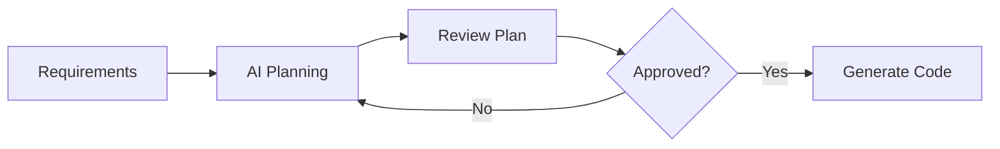

# AI-Assisted Development Guide

This guide provides best practices for leveraging AI coding assistants (Claude Code, GitHub Copilot, etc.) in the LottoPass project.

## Table of Contents
1. [Effective Prompting](#effective-prompting)
2. [Context Management](#context-management)
3. [Code Generation Workflow](#code-generation-workflow)
4. [Review and Validation](#review-and-validation)
5. [Common Use Cases](#common-use-cases)
6. [Security Guidelines](#security-guidelines)
7. [Troubleshooting](#troubleshooting)

## Effective Prompting

### The CRISP Framework

**C**ontext - Provide project background
**R**equirements - Specify exact needs
**I**nput/Output - Define data structures
**S**tandards - Reference style guides
**P**erformance - State constraints

#### Example: Component Generation
```
Context: Building a lottery statistics dashboard in React/TypeScript monorepo
Requirements: Create a number frequency chart component
Input/Output: 
  - Input: Array of Draw objects with numbers and dates
  - Output: Interactive bar chart showing frequency
Standards: Follow CODE_STYLE.md, use Chart.js
Performance: Should handle 1000+ draws efficiently
```

### Prompt Templates

#### 1. Feature Implementation
```
Task: Implement [feature name]
Context: [Current project state, dependencies]
Requirements:
- [Functional requirement 1]
- [Functional requirement 2]
- Must integrate with [existing system]
Technical specs:
- Framework: [React/Next.js]
- State management: [Zustand/TanStack Query]
- Styling: [Tailwind/CSS Modules]
Constraints:
- Performance: [specific metrics]
- Browser support: [requirements]
Examples: [Optional reference code]
```

#### 2. Bug Fixing
```
Issue: [Description of the bug]
Steps to reproduce:
1. [Step 1]
2. [Step 2]
Expected: [What should happen]
Actual: [What actually happens]
Context: [Relevant code location]
Environment: [Browser, version, etc.]
```

#### 3. Refactoring
```
Target: [File/component to refactor]
Goals:
- [Goal 1, e.g., improve performance]
- [Goal 2, e.g., enhance readability]
Constraints:
- Maintain existing API
- Keep test coverage above 80%
- No breaking changes
Current issues: [Problems to solve]
```

## Context Management

### Project Context File

Create a `.ai-context` file in your project root:

```yaml
project: LottoPass
type: Monorepo
stack:
  - React 19
  - TypeScript 5.7
  - Next.js 15
  - React Native
  - TanStack Query
  - Zustand
  
architecture:
  - packages/core: Business logic
  - packages/ui: Shared components
  - apps/web: Next.js application
  - apps/mobile: React Native app

conventions:
  - Functional components only
  - TypeScript strict mode
  - CSS Modules for styling
  - Feature-based structure

testing:
  - Vitest for unit tests
  - React Testing Library
  - 80% coverage target
```

### Session Context

When starting an AI session:

1. **Set the Stage**
   ```
   I'm working on the LottoPass lottery statistics platform.
   Tech stack: React 19, TypeScript, Next.js 15, Monorepo with Turborepo
   Current task: [specific task]
   ```

2. **Reference Documentation**
   ```
   Please follow CODE_STYLE.md and CLAUDE.md guidelines
   Use existing patterns from [reference file/component]
   ```

3. **Define Success Criteria**
   ```
   Success means:
   - All TypeScript errors resolved
   - Tests passing with >80% coverage
   - Follows accessibility standards
   - Performance metrics met
   ```

## Code Generation Workflow

### 1. Planning Phase


Use Planning Mode (Shift+Tab twice in Claude Code):
- Explore codebase without modifications
- Understand existing patterns
- Plan implementation strategy

### 2. Generation Phase

#### Progressive Enhancement
Start simple, then iterate:

```typescript
// Iteration 1: Basic structure
export const NumberChart: React.FC = () => {
  return <div>Chart placeholder</div>;
};

// Iteration 2: Add props and types
interface NumberChartProps {
  data: FrequencyData[];
  title?: string;
}

export const NumberChart: React.FC<NumberChartProps> = ({ data, title }) => {
  // Implementation
};

// Iteration 3: Add features incrementally
```

#### Chunk Large Tasks
Break down complex features:

1. Data layer (types, API calls)
2. State management
3. UI components
4. Integration
5. Testing
6. Documentation

### 3. Integration Phase

Use these commands for seamless integration:
- `/refactor-imports` - Clean up imports
- `/check-conventions` - Verify architecture
- `/test-component` - Generate tests

## Review and Validation

### AI Code Review Checklist

#### 🔒 Security
- [ ] No hardcoded credentials
- [ ] Input validation implemented
- [ ] XSS prevention in place
- [ ] API endpoints secured
- [ ] No sensitive data in logs

#### 🏗️ Architecture
- [ ] Follows monorepo boundaries
- [ ] Correct package dependencies
- [ ] Proper separation of concerns
- [ ] No circular dependencies

#### 📝 Code Quality
- [ ] TypeScript strict compliance
- [ ] No `any` types
- [ ] Proper error handling
- [ ] Meaningful variable names
- [ ] DRY principles followed

#### 🧪 Testing
- [ ] Unit tests included
- [ ] Edge cases covered
- [ ] Mocks properly implemented
- [ ] Accessibility tests added

#### 🚀 Performance
- [ ] No unnecessary re-renders
- [ ] Proper memoization
- [ ] Lazy loading implemented
- [ ] Bundle size impact checked

### Validation Commands

```bash
# Automated validation sequence
npm run lint
npm run type-check
npm run test
/check-conventions
/check-a11y
/perf-audit
```

## Common Use Cases

### 1. Component Generation

**Prompt Example:**
```
Create a LotteryBallSelector component:
- Display numbers 1-45 in a grid
- Allow selecting 6 numbers
- Highlight selected numbers
- Disable selection after 6
- Include "Clear" and "Random" buttons
- Use Tailwind for styling
- Add proper TypeScript types
- Include unit tests
```

### 2. API Integration

**Prompt Example:**
```
Create a TanStack Query hook for fetching lottery statistics:
- Endpoint: /api/lottery/stats
- Cache for 5 minutes
- Include error handling
- Transform response to StatisticsData type
- Add loading and error states
- Include retry logic
```

### 3. State Management

**Prompt Example:**
```
Create a Zustand store for user preferences:
- Theme (light/dark)
- Favorite numbers
- Notification settings
- Persist to localStorage
- Include TypeScript types
- Add reset functionality
```

### 4. Data Transformation

**Prompt Example:**
```
Create a function to analyze lottery number patterns:
- Input: Array of historical draws
- Calculate: frequency, hot/cold numbers, patterns
- Return: Statistical analysis object
- Handle edge cases (empty data, invalid numbers)
- Optimize for large datasets
```

## Security Guidelines

### What NOT to Share with AI

1. **Never Include:**
   - API keys or tokens
   - Database credentials
   - User personal data
   - Production URLs
   - Security vulnerabilities

2. **Sanitize Examples:**
   ```typescript
   // ❌ Bad
   const API_KEY = "sk-1234567890abcdef";
   
   // ✅ Good
   const API_KEY = process.env.NEXT_PUBLIC_API_KEY;
   ```

3. **Mock Sensitive Data:**
   ```typescript
   // Use fake data for examples
   const mockUser = {
     id: "user_123",
     email: "test@example.com",
     // Not real user data
   };
   ```

### Secure Code Patterns

Request AI to follow these patterns:

1. **Environment Variables**
   ```typescript
   // Always use env vars for configuration
   const config = {
     apiUrl: process.env.NEXT_PUBLIC_API_URL,
     wsUrl: process.env.NEXT_PUBLIC_WS_URL,
   };
   ```

2. **Input Validation**
   ```typescript
   // Request validation with Zod
   const schema = z.object({
     numbers: z.array(z.number().min(1).max(45)).length(6),
   });
   ```

3. **Error Handling**
   ```typescript
   // Never expose internal errors
   try {
     // operation
   } catch (error) {
     logger.error('Operation failed', error);
     throw new Error('An error occurred');
   }
   ```

## Troubleshooting

### Common Issues and Solutions

#### 1. Context Loss
**Problem:** AI forgets project context
**Solution:** 
- Use `/init` command
- Reference CLAUDE.md
- Provide explicit reminders

#### 2. Inconsistent Code Style
**Problem:** Generated code doesn't match project style
**Solution:**
- Reference CODE_STYLE.md explicitly
- Provide examples from codebase
- Use `/enforce-style` command

#### 3. Over-Engineering
**Problem:** AI creates overly complex solutions
**Solution:**
- Request "simplest solution first"
- Specify constraints clearly
- Iterate incrementally

#### 4. Type Mismatches
**Problem:** TypeScript errors in generated code
**Solution:**
- Provide complete type definitions
- Request "strict TypeScript compliance"
- Use `/api-types` for external APIs

### Best Practices Summary

1. **Start Small:** Begin with simple tasks and build complexity
2. **Be Specific:** Clear requirements yield better results
3. **Iterate:** Refine through multiple interactions
4. **Verify:** Always review and test generated code
5. **Document:** Track AI contributions for future reference
6. **Learn:** Use AI to learn new patterns and techniques

## Continuous Improvement

### Feedback Loop

1. **Track Success:**
   - Document effective prompts
   - Share successful patterns
   - Build prompt library

2. **Learn from Failures:**
   - Analyze ineffective prompts
   - Identify missing context
   - Update guidelines

3. **Optimize Workflow:**
   - Measure time savings
   - Identify bottlenecks
   - Refine processes

### Team Collaboration

1. **Share Knowledge:**
   - Maintain prompt templates
   - Document AI patterns
   - Create team guidelines

2. **Code Reviews:**
   - Flag AI-generated code
   - Review for best practices
   - Ensure human oversight

3. **Continuous Learning:**
   - Stay updated on AI capabilities
   - Experiment with new techniques
   - Share discoveries with team

Remember: AI is a powerful tool, but human judgment, creativity, and oversight remain essential for building quality software.